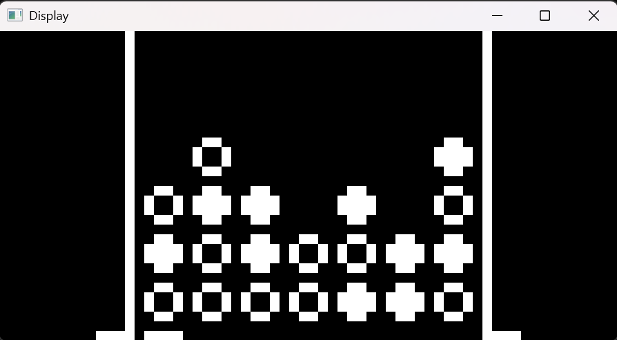
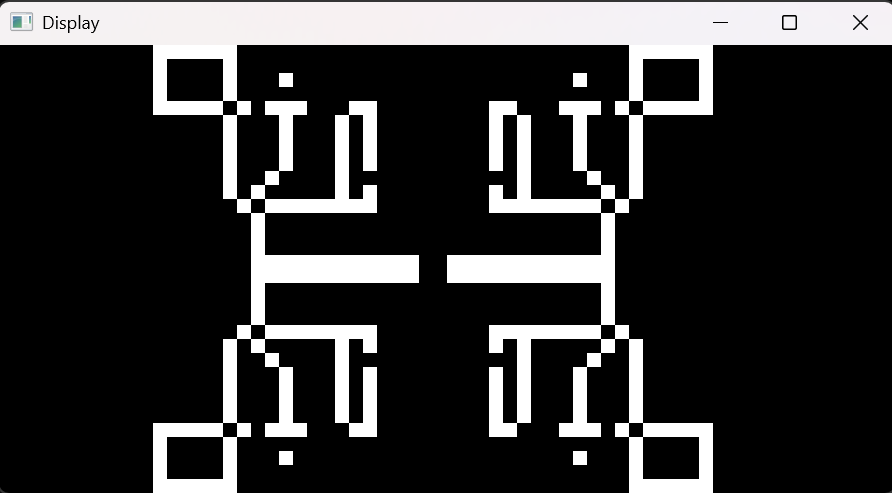
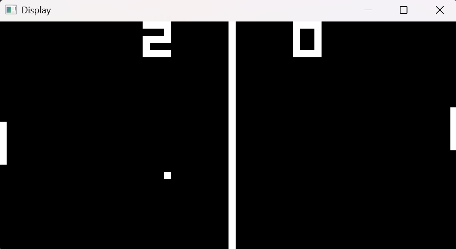

# CHIP-8 Emulator (C++)

A small and portable **CHIP-8 emulator** written in modern C++ using **SFML** for graphics and input. The emulator runs classic `.ch8` ROMs (games/programs).

---

## What is CHIP-8? What is an emulator?
- **CHIP-8** is a simple interpreted language/virtual machine from the 1970s used by early home computers. Many classic tiny games were written for CHIP-8; they are distributed as `.ch8` binary ROM files.
- An **emulator** is a program that imitates another system. This emulator implements the CHIP-8 instruction set, timers, display and input so your computer can run CHIP-8 ROMs as if it were the original hardware.

---

## Quick summary
- Build the project with Visual Studio or CMake/g++.
- Run the emulator and pass a `.ch8` file path as a **command-line argument** (or it will run a default ROM from `roms/`).
- You can put `.ch8` files in the `roms/` folder that ships with the repo, or download other `.ch8` ROMs and run them by path.

---

## Features
- Implements the core CHIP-8 opcodes and timers
- 64×32 monochrome display (scaled for modern screens)
- SFML-based window, input and optional audio
- Hex-keypad mapping to a PC keyboard (configurable in code)
- Accepts ROM path as a command-line argument; falls back to a default ROM in `roms/`

---

## Build instructions

### Windows / Visual Studio (recommended)
1. Open `Chip-8.sln` in Visual Studio.
2. Make sure SFML is installed and linked (or use the project settings already configured in the solution).
3. Build the solution (Build → Build Solution).
4. The executable will be in the build folder (for example `x64/Debug/Chip-8.exe`).

> **Tip:** If SFML is not bundled in the solution, install SFML and update the project properties to point to SFML `include` and `lib` directories.

---

## Run / Usage
You can run the emulator either from **Visual Studio** or directly in the **Command Prompt**.


If you run the program manually from x64/Debug/, you need to adjust the path to the ROMs folder:
```bash
Chip-8.exe ..\..\roms\pong.ch8
```

Alternatively, you can provide the full path to a ROM:
```bash
Chip-8.exe C:\Users\YourName\Path\To\CHIP-8-Emulator\roms\pong.ch8
```

The program accepts a single optional argument: the path to a `.ch8` ROM file. If none is provided, it loads the default ROM from `roms/`.

### Passing arguments in Visual Studio
1. Right-click the project → **Properties**.
2. Under **Configuration Properties → Debugging**, set **Command Arguments** to:
```
roms/pong.ch8
```
3. Apply and run (F5). Your argument will be passed to `main(int argc, char* argv[])` as `argv[1]`.

---

## Controls (default mapping)
The CHIP-8 16-key keypad is mapped to your PC keyboard in a 4×4 layout:

CHIP-8 keypad layout (0–F) -> PC keys

```
1 2 3 C    -> 1 2 3 4
4 5 6 D    -> Q W E R
7 8 9 E    -> A S D F
A 0 B F    -> Z X C V
```
Use these keys on your keyboard to control the emulator.

---

## ROMs (.ch8 files)
- `roms/` contains a few example `.ch8` ROMs for quick testing.
- You can **download other `.ch8` ROMs** from public ROM collections and run them with the emulator by passing their path as an argument.
- If you store ROMs outside the repo, pass the full path or relative path when running the emulator.

---

## Troubleshooting
- If the window fails to open or SFML errors appear, ensure SFML is correctly installed and linked.
- If a ROM fails to load, double-check the path (relative paths are relative to the current working directory where you run the executable).
- If input doesn’t register, click the emulator window to ensure it has focus.

---

## Examples Screenshots

### Conncet 4:



### X Mirror:



### Pong:




**Enjoy**

